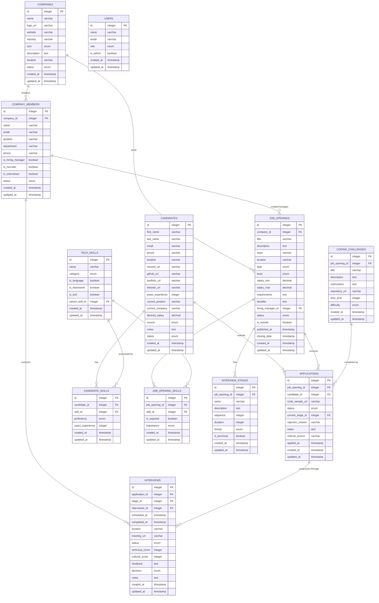

# Orca API - ATS (Applicant Tracking System)

A Laravel-based API server for managing the recruitment process, built for an OfferZen dev workshop. This API provides endpoints for managing companies, job openings, candidates, applications, interviews, and more.

## Docs

The API docs are hosted at [orca-api.laravel.cloud](https://orca-api.laravel.cloud/docs)

## Features

- Company management
- Job opening creation and management
- Candidate tracking
- Application processing
- Interview scheduling and feedback
- Technical skills management
- Coding challenge management

## Entity diagram



## Tech Stack

- **Backend**: Laravel 12
- **Frontend**: React 19 with Inertia.js
- **Database**: SQLite (for development)
- **Authentication**: Bearer Token
- **API Documentation**: Scribe

## Prerequisites

- PHP 8.2 or higher
- Node.js (latest LTS version)
- Composer
- SQLite

## Installation

1. Clone the repository:
```bash
git clone [repository-url]
cd orca-api
```

2. Install PHP dependencies:
```bash
composer install
```

3. Install JavaScript dependencies:
```bash
npm install
```

4. Create environment file:
```bash
cp .env.example .env
```

5. Generate application key:
```bash
php artisan key:generate
```

6. Create database:
```bash
touch database/database.sqlite
```

7. Run migrations:
```bash
php artisan migrate
```

## Running the Application

### Development Mode

To run the application in development mode with hot reloading:

```bash
composer run dev
```

This will start:
- Laravel development server
- Queue worker
- Log watcher
- Vite development server

### Server-Side Rendering (SSR)

To run with SSR enabled:

```bash
composer run dev:ssr
```

## Authentication

The API uses Bearer Token authentication. To generate a new token:

```bash
php artisan token:generate
```

Use the generated token in your API requests by including it in the Authorization header:

```
Authorization: Bearer your-token-here
```

## API Documentation

API documentation is available at `/docs` when running the application locally.

## Testing

Run the test suite with:

```bash
composer test
```

## Contributing

This is a workshop project for OfferZen. Please follow the workshop guidelines for any contributions.

## License

This project is licensed under the MIT License. 